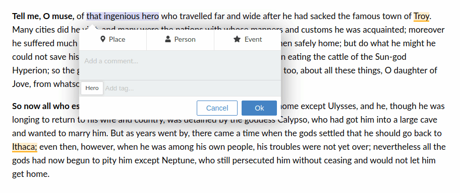

# RecogitoJS

__RecogitoJS__ is an experiment to extract the annotation functionality
of [Recogito](https://recogito.pelagios.org) to an independent, client-only 
JavaScript library. With __RecogitoJS__, we want to bring Recogito-like 
annotation to any website, and enable everyone to build customized annotation
applications more easily. [Try the demo](https://pelagios.org/recogito-text-js/index.html).



__This project is just getting started. To make it happen, we need your help. Get in touch if you want to contribute!__

## Using RecogitoJS

The example below shows how to make text annotate-able with just a few lines of JavaScript.
The full API documentation is on the [Wiki](../../wiki/Developer-Documentation).

```html
<body>
  <!-- The text content we want to annotate -->
  <pre id="content">My text to annotate.</pre>

  <!-- Initialize Recogito and load a bunch of annotations -->
  <script type="text/javascript">
    (function() {

      var r = Recogito.init({
        // REQUIRED - id of the element to make annotate-able
        content: 'content',

        // OPTIONAL - 'true' for read-only display (default = false)
        readOnly: false,

        // OPTIONAL - a function that allows you to add your
        // your own CSS class names based on annotation characteristics.
        formatter: function(annotation) {
          return 'my-class';
        }
      });

      r.loadAnnotations('annotations.w3c.json');

      // Add event handlers using .on  
      r.on('createAnnotation', function(annotation) {
        // Do something
      });

    })();
  </script>
</body>
```

## Developer Information

The plan is to organize the project into a number of sub-modules.

- __recogito-text-highlights__ is a dependency-free JavaScript
  library that handles text highlight rendering and mouse selection
- __recogito-annotation-editor__ is a [React](https://reactjs.org/)
  project for the annotation editor popup window

To run the project in development mode:

- Enter the `recogito-text-highlights` folder and run `npm install` to 
  install dependencies
- Enter the `recogito-annotation-editor` folder and run `npm install`
- Run `npm start` and go to [localhost:3000](http://localhost:3000)

To build the minified bundle, run `npm run build`.

## Annotation Format

RecogitoJS supports annotations in JSON-LD, according to the
[W3C Web Annotation model](https://www.w3.org/TR/annotation-model/).

```json
{
  "@context": "http://www.w3.org/ns/anno.jsonld",
  "id": "http://example.org/annotation/494718ed-72a7-4d33-b78e-e74b5f00259e",
  "type": "Annotation",
  "body": [{
    "type": "TextualBody",
    "value": "This is a comment."
  }],
  "target": {
    "source": "http://example.com/my-page",
    "selector": [{
      "type": "TextQuoteSelector",
      "exact": "Troy"
    },{
      "type": "TextPositionSelector",
      "start": 106,
      "end": 110
    }]
  }
}
```

## Next Steps

This project is just getting started. Ultimately, we'd like to port the full
range of features from Recogito to RecogitoJS. For now, however, the following 
things are highest up on the wishlist: 

- Geo-Tagging via the Recogito API
- TEI annotation via [CETEIcean](https://github.com/TEIC/CETEIcean)
- A generic semantic tagging component based on Wikidata and/or the OpenRefine 
  Reconciliation API specification

## License

[BSD 3-Clause](LICENSE) (= feel free to use this code in whatever way
you wish. But keep the attribution/license file, and if this code
breaks something, don't complain to us :-) 

